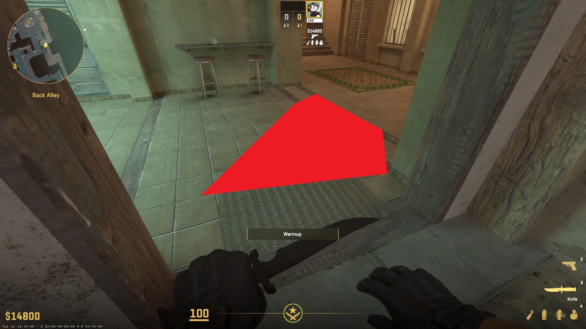
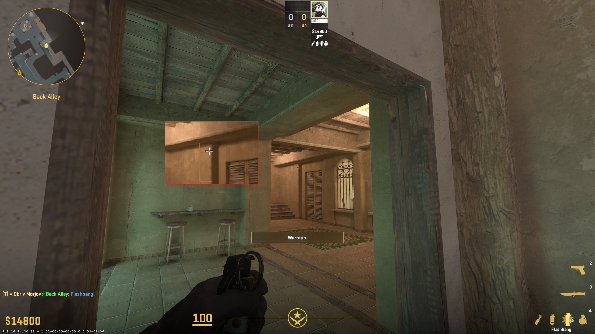
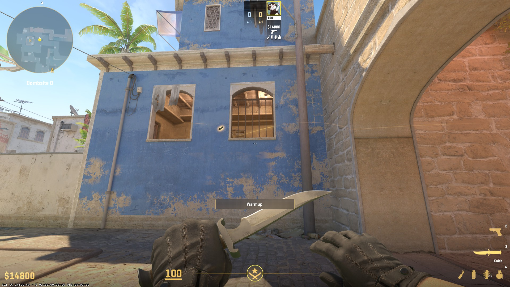

### From aps
**Throw technique:** run-throw  
**Comment:** кидается на ходу, целишься примерно в пределах серого прямоугольника, кидаешь когда проходишь кухню как показано не первом скриншоте. Какой-то сверхточности тут не нужно, главное находится в границах отметки и кидать в границах прямоугольника
