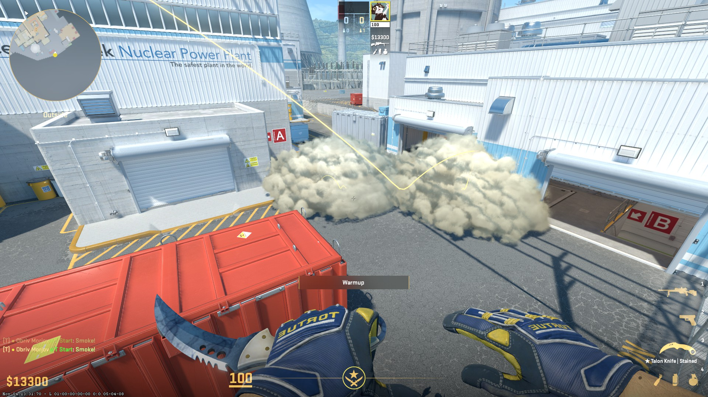
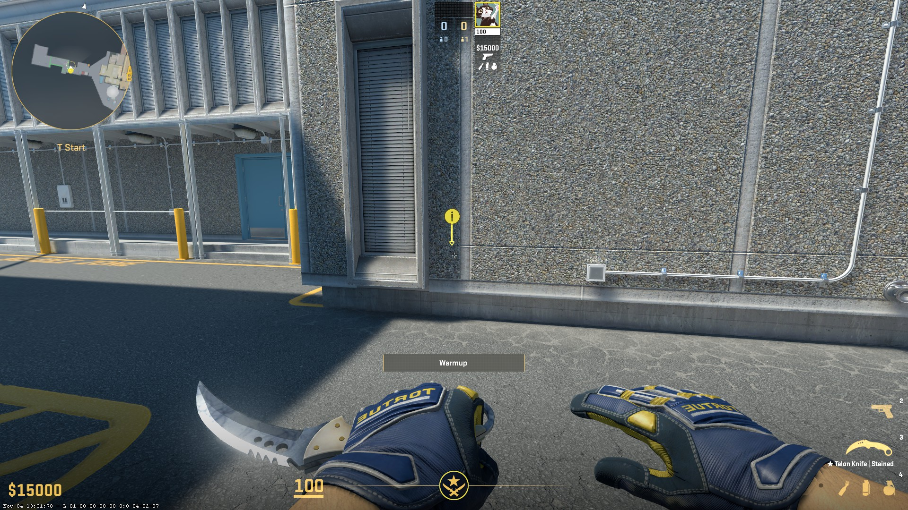
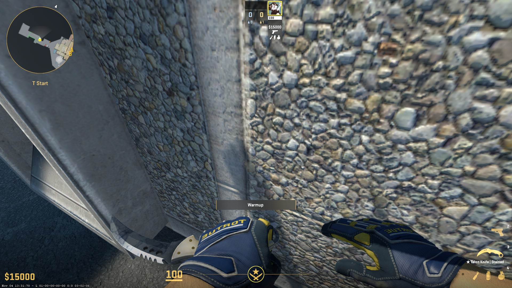
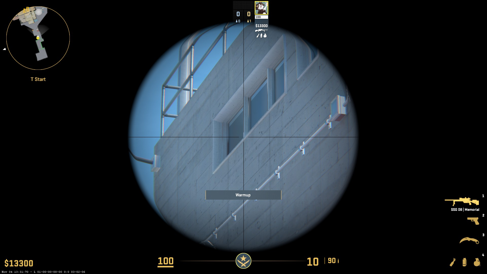
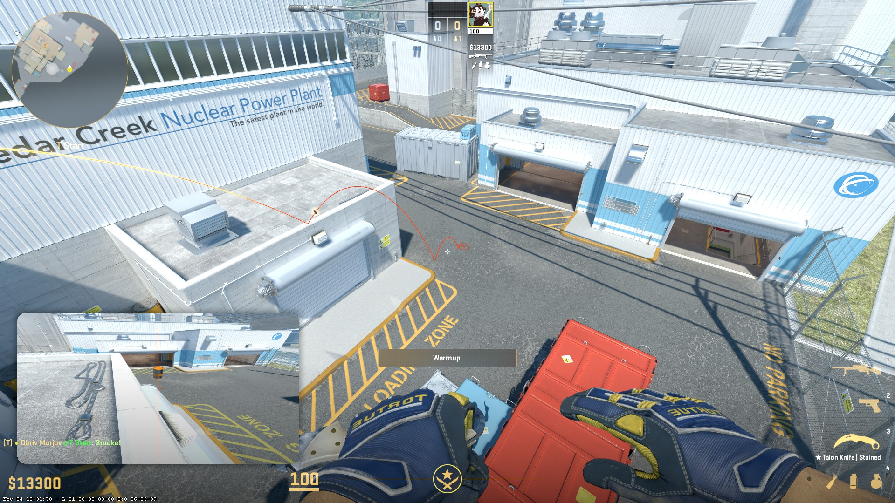
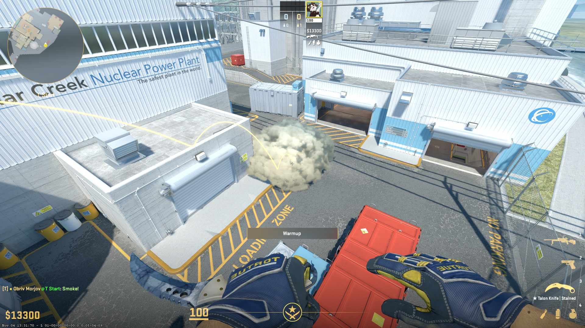
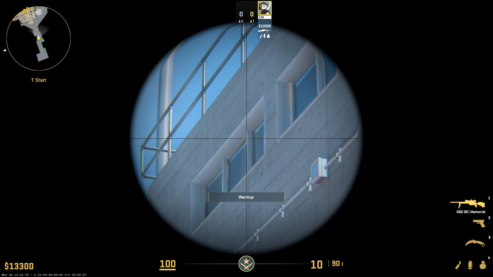
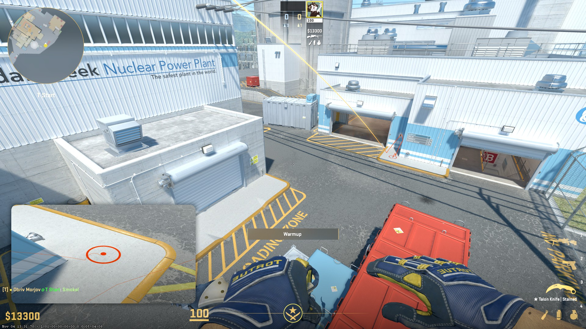
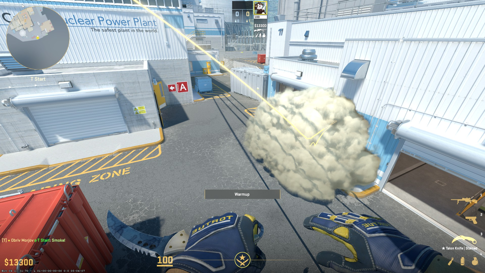

Лайнап для такого смоквола:

### From t-spawn
**Throw technique:** jump-throw  
**Comment:** встаешь в угол, можно на шифте упереться и двигаться пока двигается

### From t-spawn
**Throw technique:** shift-run-throw 
**Comment:** кидается с того же сетапа
